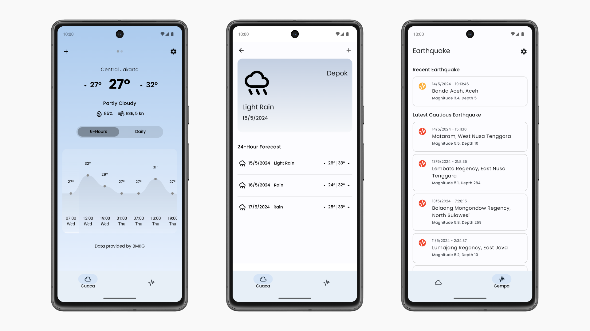

# Cuaca & Gempa

Cuaca & Gempa (english: Weather & Earthquake) is an Android application that serves weather forecast
data and earthquake information sourced from [Data Terbuka BMKG](https://data.bmkg.go.id).

### Screenshots

This project is a **work in progress**, some features and functionalities may be added or
modified in future updates.

## Background

This project serves as a case study for applying modern Android development practices, 
including design, architecture, and modularization, 
demonstrated in the [Now in Android](https://github.com/android/nowinandroid).

## Features

* Daily and 6-hourly weather forecasts for the next 3 days 
* Up-to-date earthquake information 
* Offline-first support 
* Material 3 UI 
* Dark mode

## Credits

* Badan Meteorologi, Klimatologi, dan Geofisika (BMKG) / Meteorology, Climatology, and Geophysical Agency -
  They have made their data available through [Data Terbuka BMKG](https://data.bmkg.go.id) platform, which serves as a valuable resource
  for this project.